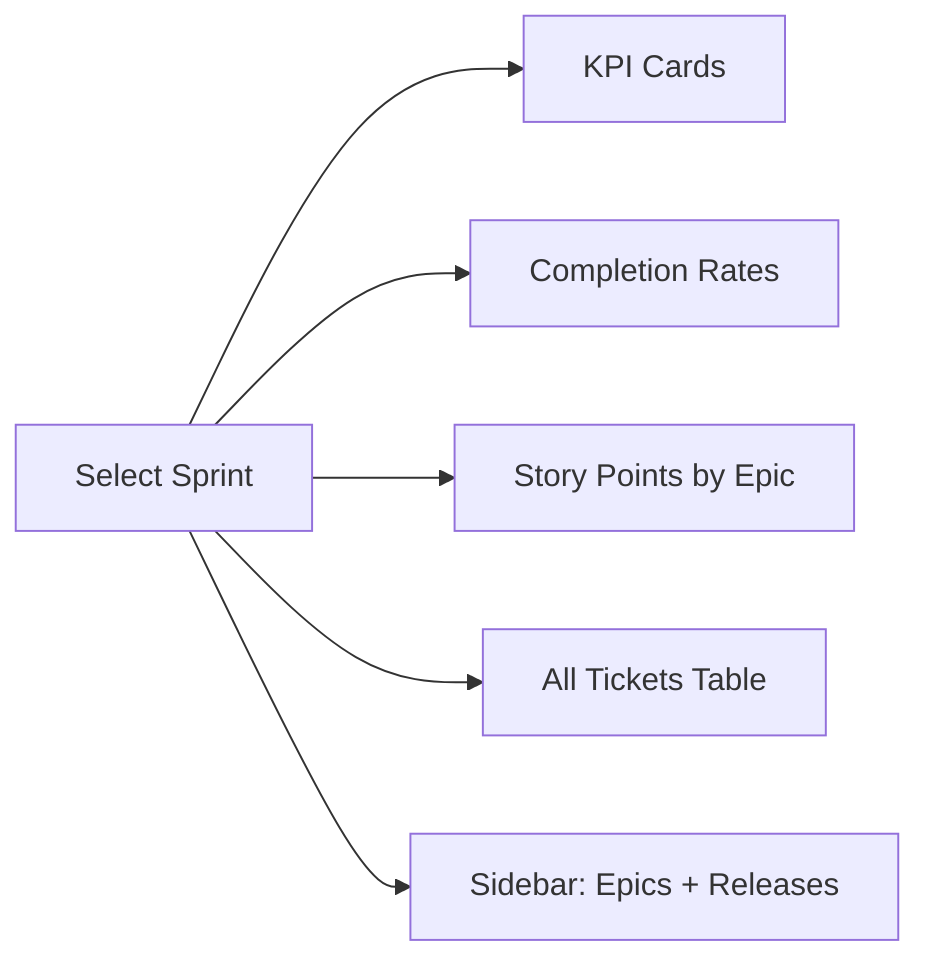
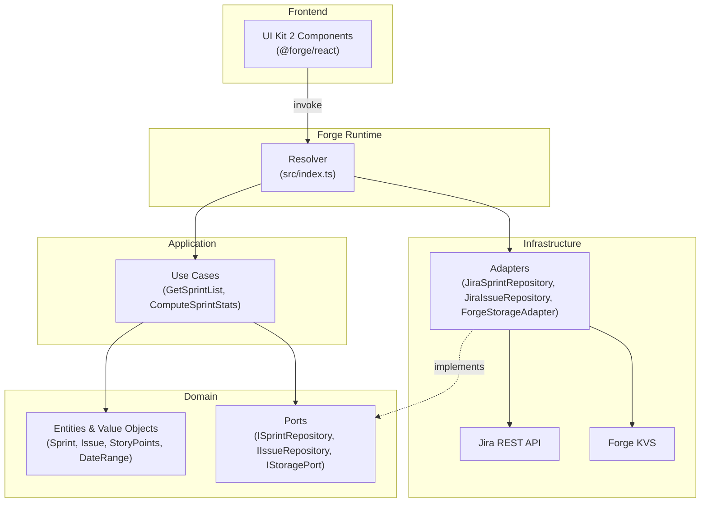
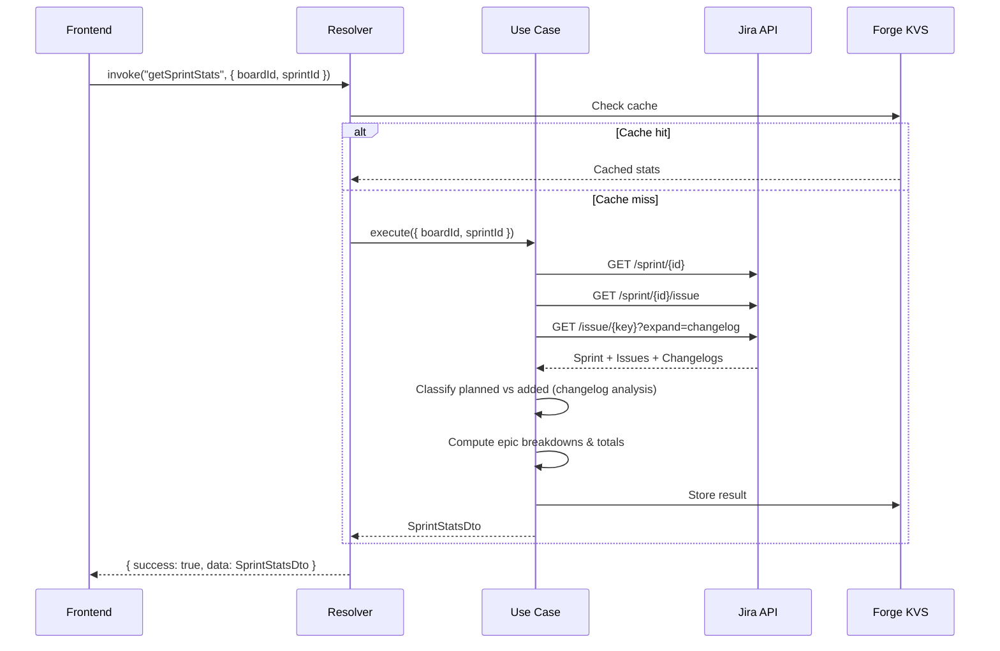

# Sprint Review for Jira

An Atlassian Forge app that gives engineering and product managers a clear, data-driven view of sprint performance — right inside Jira.

Built with **TypeScript**, **Forge UI Kit 2**, and **clean architecture**.

## Features

- **KPI dashboard** — planned, added, and completed story points at a glance
- **Completion rates** — color-coded progress bars for planned, added, and total work
- **Epic breakdown** — stacked bar chart and grouped ticket table per epic
- **Sidebar** — epic filter with checkboxes, release progress, and sprint-scoped release list
- **Jira-native UI** — uses Atlassian Design System tokens and UI Kit 2 components



## Getting Started

### Prerequisites

- [Node.js](https://nodejs.org/) 22+
- [Atlassian Forge CLI](https://developer.atlassian.com/platform/forge/getting-started/)
- A Jira Cloud site with a Scrum board

### Install and Deploy

```bash
# Install dependencies
npm install

# Register a new Forge app (first time only)
forge register

# Deploy to your Atlassian environment
forge deploy

# Install on your Jira site
forge install --site your-site.atlassian.net --product jira
```

### Development

```bash
# Type-check
npm run typecheck

# Run tests
npm test

# Live reload during development
forge tunnel
```

## Architecture

The app follows **clean architecture** with four layers. No layer depends on an outer layer.



See [`docs/architecture.md`](docs/architecture.md) for detailed data flow and design decisions.

## How It Works



## Roadmap

- [ ] AI-driven sprint summary for leadership reporting
- [ ] Sprint-over-sprint velocity trends
- [ ] Export to PDF / Confluence
- [ ] Atlassian Marketplace listing

## License

[MIT](LICENSE)
