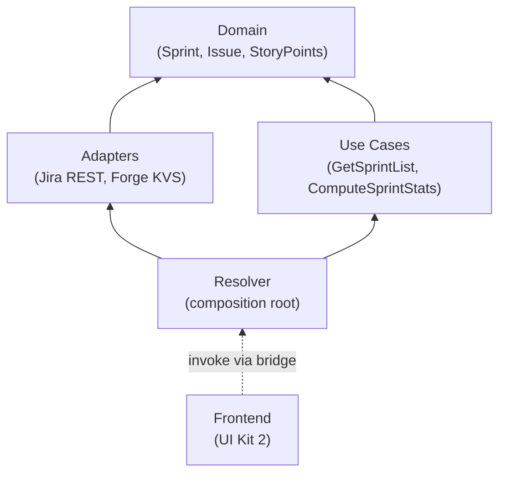
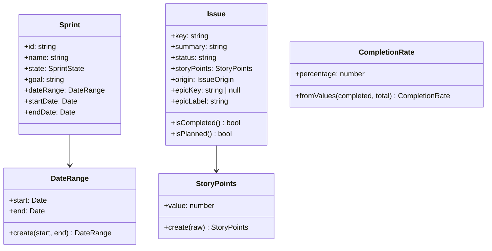
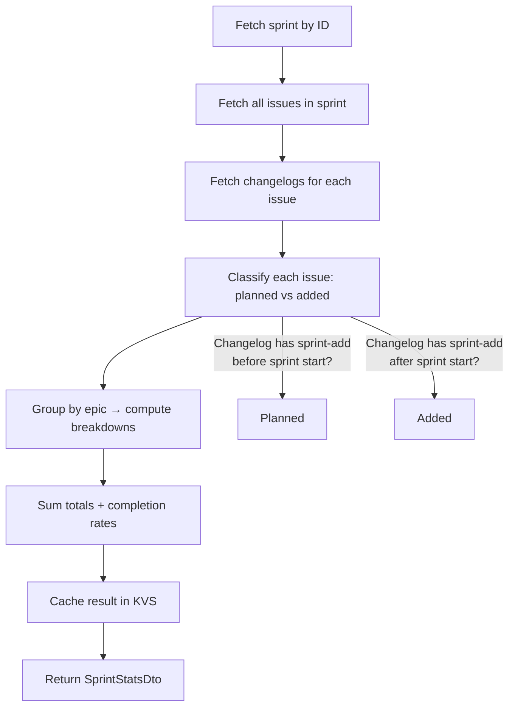
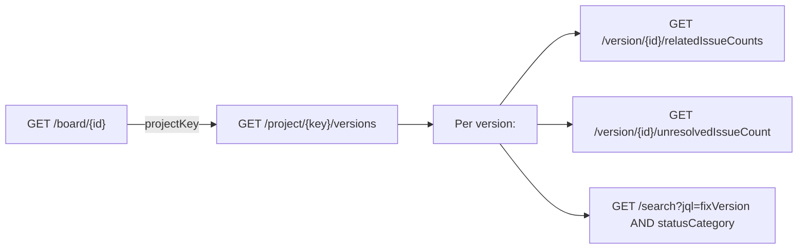
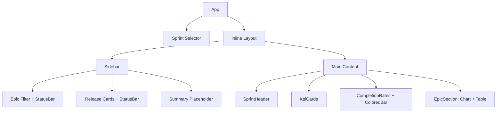
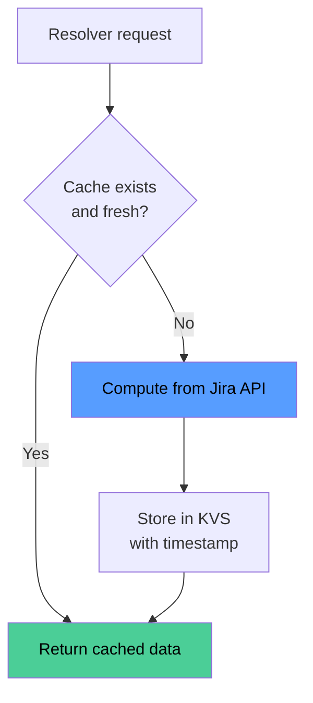

# Architecture

Sprint Review for Jira follows **clean architecture** — domain logic has zero dependencies on Forge, Jira APIs, or UI frameworks.

## Layer Dependency Rule

Arrows point **inward** — outer layers depend on inner layers, never the reverse.

## Domain Layer

Pure TypeScript with no framework imports.

### Ports (interfaces)

| Port | Purpose |
|---|---|
| `ISprintRepository` | Fetch sprints for a board or by ID |
| `IIssueRepository` | Fetch issues for a sprint + changelogs |
| `IStoragePort` | Get/set/delete cached values |

## Use Cases

### GetSprintList

Fetches all sprints for a board and returns them sorted newest-first.

### ComputeSprintStats

The core use case. Given a board and sprint:

**Planned vs Added classification**: An issue is "planned" if the earliest changelog entry adding it to the sprint predates the sprint start. Otherwise it's "added" (scope change).

## Adapters

| Adapter | Implements | Jira Endpoints |
|---|---|---|
| `JiraSprintRepository` | `ISprintRepository` | `GET /rest/agile/1.0/board/{id}/sprint`, `GET /rest/agile/1.0/sprint/{id}` |
| `JiraIssueRepository` | `IIssueRepository` | `GET /rest/agile/1.0/sprint/{id}/issue`, `GET /rest/api/3/issue/{key}?expand=changelog` |
| `ForgeStorageAdapter` | `IStoragePort` | Forge KVS (`@forge/kvs`) |

### Field Auto-Discovery

Story point and sprint field IDs vary across Jira instances. The adapter discovers them dynamically via `GET /rest/api/3/field` and caches the result for 1 hour in KVS.

### Release Data

## Frontend

The frontend uses **Forge UI Kit 2** (`@forge/react`) — no custom HTML, no DOM. All styling uses `xcss` with Atlassian Design System tokens.

### Styling Rules

- All `xcss` calls live in `styles.ts` — components never import `xcss` directly
- Progress bar fills use a factory function (`barFill`) for dynamic widths
- Color tokens follow Atlassian's semantic palette (success, information, neutral)

## Caching Strategy

- **Sprint stats**: 5-minute TTL, keyed by `sprint:{boardId}:{sprintId}:stats`
- **Field IDs**: 1-hour TTL, keyed by `sys:fieldIds`
- `forceRefresh` flag bypasses cache when needed

## Testing

Tests cover each layer independently with in-memory mocks:

- **Domain tests** — value object validation, entity behavior
- **Use case tests** — origin classification, totals computation, caching
- **Adapter tests** — API response mapping, pagination, storage validation
